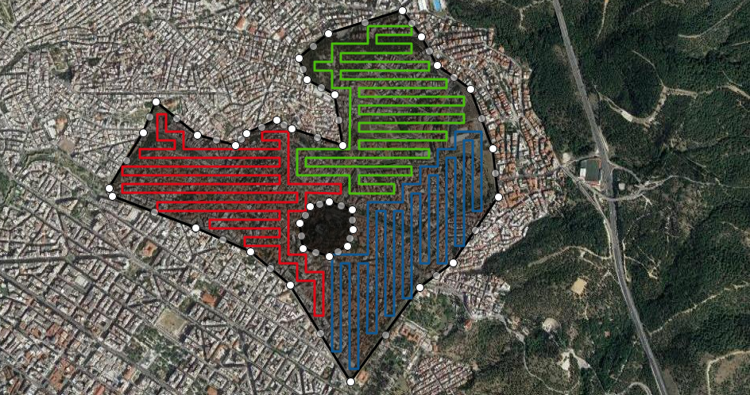
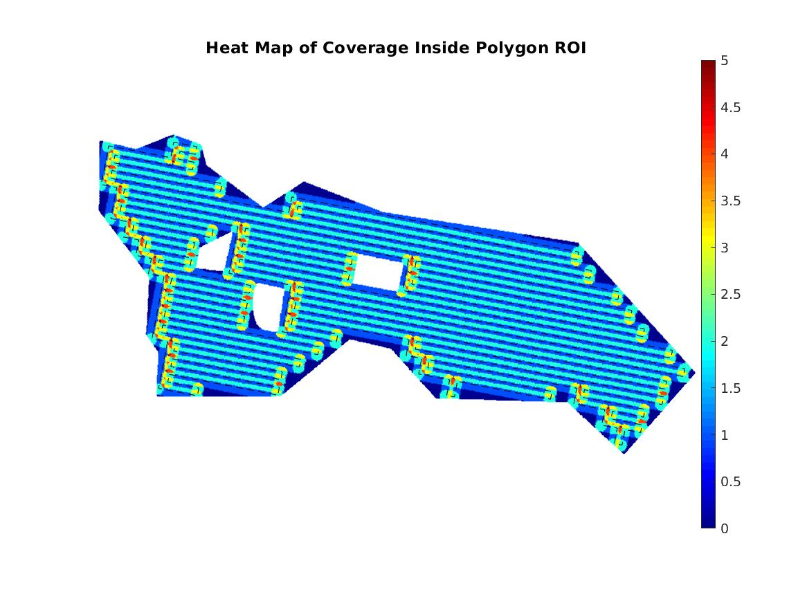
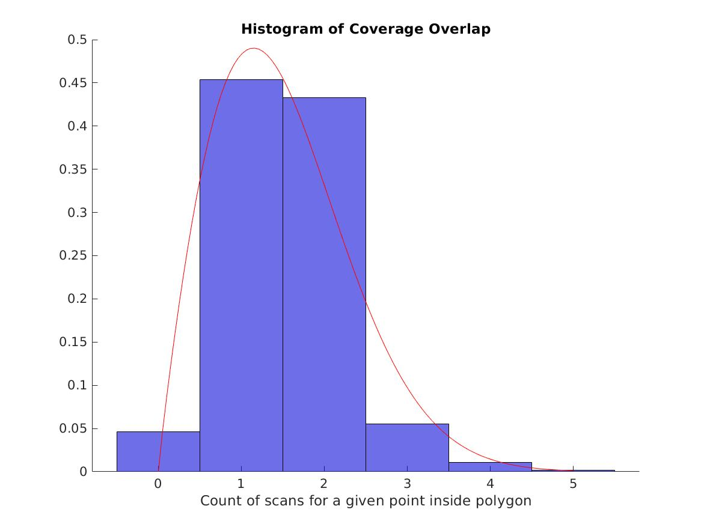

# Cooperative Multi-UAV Coverage Mission Planning Platform for Remote Sensing Applications - Simulated Evaluation




## Description
In this repository you can find a set of 20 polygon Regions of Interest (ROIs) that were used for the evaluation of an
innovative, optimized for real-life use, STC-based, multi-robot Coverage Path Planning (mCPP) algorithm, based on a previous work of our lab [ [paper](http://kapoutsis.info/wp-content/uploads/2017/02/j3.pdf) | [implementation](https://github.com/athakapo/DARP) ], along with the
elaborate results for each ROI. In the context of this work, was developed and proposed an innovative optimization scheme,
consisted of three separate terms (J_1, J_2 and J_3). In the results you can find the performance evaluation for the plain,
non-optimized STC approach, and for the STC algorithm with the introduction of this optimization procedure, term-by-term.
In addition to that, for each ROI are also calculated coverage plans, according to the methodology described in
[ [paper](https://arxiv.org/abs/1907.09224) | [implementation](https://github.com/ethz-asl/polygon_coverage_planning) ], with two different cost
functions that intend to reduce the number of turns and overall length of path respectively. These results for all ROIs are also available
in details.


## Evaluation metrics
For each generated path were calculated the following evaluation metrics:

- Percentage of Coverage (PoC)
- Percentage of Overlapping Coverage (PoOC)
- Number of turns
- Normalized Number of Turns
- Path length
- Normalized path length

In addition to them were created a heatmap of coverage for the paths in each ROI (example in the following image)



and a histogram of overlapping coverage, showing the times that each coverage point of the ROI was scanned (example in the
following image)




## Results structure
In folders 1-20 are included the elaborate results for each one of the 20 ROIs accordingly. Each of these folders
contain 6 sub-folders, one for each methodology used for the path generation. The first four (0-3) are for the STC-based
approach, while the other two (4-5) are for the work described in [ [paper](https://arxiv.org/abs/1907.09224) | [implementation](https://github.com/ethz-asl/polygon_coverage_planning) ]. Specifically the sub-folders included are:

- 0 - No Optimization
- 1 - J1 Optimization
- 2 - J1+J2 Optimization
- 3 - Optimal
- 4 - ETHZ Length Reduction
- 5 - ETHZ WP Reduction

In addition to those 20 folders, there is one containing the Overall results for the evaluation of all ROIs.

For each ROI, you will find the polygon coordinates in WGS84 and in a local NED system, along with all the
evaluation metrics and figures mentioned above. In addition, a matlab variable containing the data used for the generation
of the histogram is included as well.

In the overall results, you will find the cumulative histograms of overlapping coverage, out of all ROIs, for each path
planning method, along with a matlab variable containing the data used for their generation. In addition, a spreadsheet
file containing the elaborate and average results, for all methodologies and ROIs is included.


## An implementation of the optimized mCPP methodology can be found here:

https://github.com/savvas-ap/mCPP-optimized-DARP


### In case you use this work or parts of it, please cite as:

```
S. D. Apostolidis, P. Ch. Kapoutsis, A. Ch. Kapoutsis, E. B. Kosmatoupoulos,
“Cooperative Multi-UAV Coverage Mission Planning Platform for Remote Sensing Applications”,
“Autonomous Robots”, Under Review
```