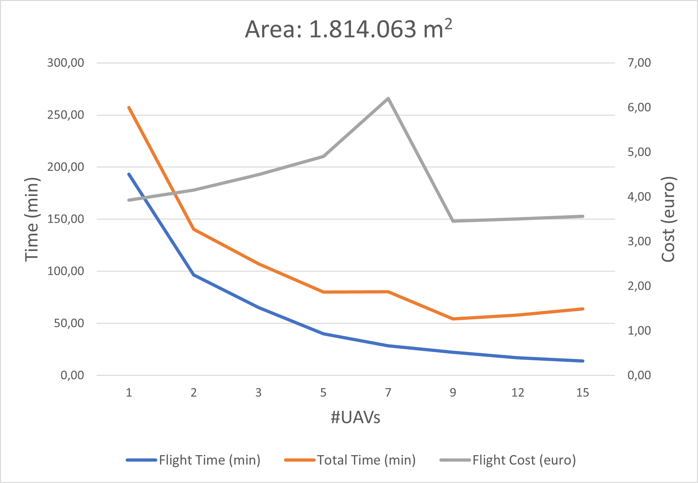

# Cooperative Multi-UAV Coverage Mission Planning Platform for Remote Sensing Applications - Simulated Evaluation


## Description
In this repository you can find all the elaborate results that were used for the simulated evaluation of an
innovative, optimized for real-life use, STC-based, multi-robot Coverage Path Planning (mCPP) algorithm, presented [in this work](https://arxiv.org/abs/2201.07030), based on a previous work of our lab
[ [paper](http://kapoutsis.info/wp-content/uploads/2017/02/j3.pdf) | [implementation](https://github.com/athakapo/DARP) ], along with the
ROIs used for the evaluations. The simulated evaluation can be divided in two major parts: (i) the Single-Robot Paths Evaluation and (ii) the Multi-Robot Marginal
utility study.

For the first part of the evaluation, a set of 20 polygon Regions of Interest (ROIs) were used.
In the context of this work, was developed and proposed an innovative optimization scheme,
consisted of three separate terms (J_1, J_2 and J_3). In the results you can find the performance evaluation for the plain,
non-optimized STC approach, and for the STC algorithm with the introduction of this optimization procedure, term-by-term.
In addition to that, for each ROI are also calculated coverage plans, according to the methodology described in
[ [paper](https://arxiv.org/abs/1907.09224) | [implementation](https://github.com/ethz-asl/polygon_coverage_planning) ], with two different cost
functions that intend to reduce the number of turns and overall length of path respectively. These results for all ROIs are also available
in details.

Building on top of that, a Multi-Robot Marginal Utility Study was performed, to investigate what is the actual
efficiency gains that can be acquired by the addition of multiple UAVs in the coverage missions with the proposed methodology.
For this study two ROIs with strategically different areas were used, where the simulation of the coverage missions was performed
by sequentially increasing the number of UAVs from 1 to 15.


## Single-Robot Paths Evaluation
### Evaluation metrics
For each generated path were calculated the following evaluation metrics:

- Percentage of Coverage (PoC)
- Percentage of Overlapping Coverage (PoOC)
- Number of turns
- Normalized Number of Turns
- Path length
- Normalized path length

In addition to them were created a heatmap of coverage for the paths in each ROI (example in the following image)


and a histogram of overlapping coverage, showing the times that each coverage point of the ROI was scanned (example in the
following image)


### Results structure
In folders 1-20 are included the elaborate results for each one of the 20 ROIs accordingly. Each of these folders
contain 6 sub-folders, one for each methodology used for the path generation. The first four (0-3) are for the STC-based
approach, while the other two (4-5) are for the work described in [ [paper](https://arxiv.org/abs/1907.09224) | [implementation](https://github.com/ethz-asl/polygon_coverage_planning) ]. Specifically the sub-folders included are:

- 0 - No Optimization
- 1 - J1 Optimization
- 2 - J1+J2 Optimization
- 3 - Optimal
- 4 - ETHZ Length Reduction
- 5 - ETHZ WP Reduction

In addition to those 20 folders, there is one containing the Overall results for the evaluation of all ROIs.

For each ROI, you will find the polygon coordinates in WGS84 and in a local NED system, along with all the
evaluation metrics and figures mentioned above. In addition, a matlab variable containing the data used for the generation
of the histogram is included as well.

In the overall results, you will find the cumulative histograms of overlapping coverage, out of all ROIs, for each path
planning method, along with a matlab variable containing the data used for their generation. In addition, a spreadsheet
file containing the elaborate and average results, for all methodologies and ROIs is included.

## Multi-Robot Marginal Utility Study
### Evaluation metrics
For each generated path were calculated the following evaluation metrics:

- Percentage of Coverage (PoC)
- Percentage of Overlapping Coverage (PoOC)
- Number of batteries needed per UAV to complete the mission (#Bat/UAV)
- Mission Time, referring to the estimated flight time for the mission
- Deployment Time, referring to the estimated time to deploy the gear for a mission
- Change Battery Delay
- Total Time
- Flight Cost

In addition to them were created a heatmap of coverage for the paths in each mission execution and a histogram of overlapping coverage as well.
Finally, some diagrams were created to visualize the Mission Time and the Total Time, contradicted to the Flight Cost (example in the following image)



## Relevant/useful material:

Article's [page](https://link.springer.com/article/10.1007%2Fs10514-021-10028-3)

arXiv [page](https://arxiv.org/abs/2201.07030)

Paper's back-end module open source implementation [repo](https://github.com/savvas-ap/mCPP-optimized-DARP)


### In case you use this work or parts of it, please cite as:

```
@article{Apostolidis_2022,
	doi = {10.1007/s10514-021-10028-3},
	url = {https://doi.org/10.1007%2Fs10514-021-10028-3},
	year = 2022, 
	month = {jan},	
	publisher = {Springer Science and Business Media {LLC}}, 
	author = {Savvas D. Apostolidis and Pavlos Ch. Kapoutsis and Athanasios Ch. Kapoutsis and Elias B. Kosmatopoulos},	
	title = {Cooperative multi-{UAV} coverage mission planning platform for remote sensing applications}, 
	journal = {Autonomous Robots}
}
```